# Game Design Document (GDD)

#### Authors
- Jack Perry
- Ayush Tyagi
- Josh Costa
- Connor Liu

### Table of contents
* [Game Overview](#game-overview)
* [Story and Narrative](#story-and-narrative)
* [Gameplay and Mechanics](#gameplay-and-mechanics)
* [Levels and World Design](#levels-and-world-design)
* [Art and Audio](#art-and-audio)
* [User Interface](#user-interface)
* [External Image References](#external-image-references)

### Game Overview
_Emu War II_ is a timed survival, resource management, tower defence game, where the player is armed with a Ute-mounted-turret and tasked with defending their farmhouse from an onslaught of pesky emus. Inspired by the events of the Great Emu War of 1932, _Emu War II_ is set on a modern day Australian farm and explores the non-zero possibility of a second emu invasion. 

Playing as the farmer, your main method of defence is an auto-firing mounted turret in the tray of your trusty work Ute, which must be maneuvered around the farm to defeat the incoming waves of emus. The catch? Your turret only has the power to fire when the Ute is parked, meaning you'll have to balance the need to stop and defeat enemies with the need to traverse the map, repositioning your turret whilst salvaging scrap for upgrades. 

  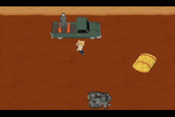  
  <em>Animated Figure 1 - Emu War II: Recording of Basic Mechanics (Original)</em>

The game's core mechanics were inspired by a handful of titles including ['_Bloons TD 6_'](https://btd6.com), ['_20 Minutes Till Dawn_'](https://store.steampowered.com/app/1966900/20_Minutes_Till_Dawn/), as well as some lesser known itch.io demos such as Matheus Cunegato's ['_TowerBag_'](https://matheuscunegato.itch.io/towerbag) (resource management, tower defence) and Pixel Forest's ['_Farmer's Stealing Tanks_']( https://pixelforest.itch.io/farmers-stealing-tanks ) (vehicle, survival). 

Note that all external images in this document can be clicked on to link directly to the source. A reference list is also avaliable at the bottom of the document.

  <a href="https://btd6.com">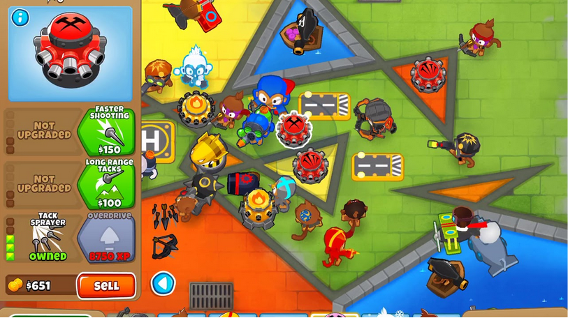</a>
  <a href="https://store.steampowered.com/app/1966900/20_Minutes_Till_Dawn/">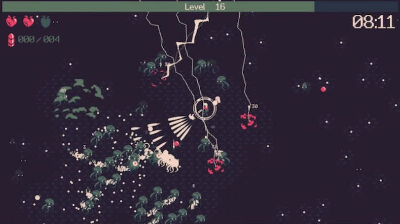</a>  
  <a href="https://matheuscunegato.itch.io/towerbag">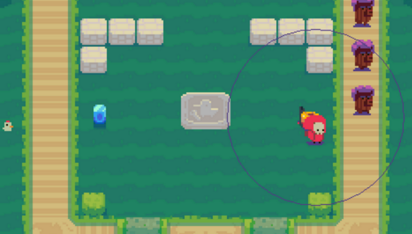</a>
  <a href="https://pixelforest.itch.io/farmers-stealing-tanks">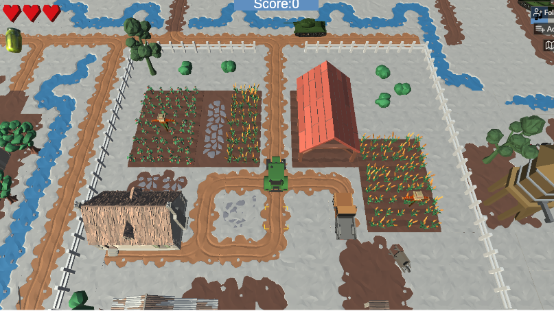</a>  
    <em>Figure 1 - Top Left: Bloons Tower Defence 6 (Ninja Kiwi, 2018) | Top Right: 20 Minutes Till Dawn (Flanne, 2022)</em>  
  <em>Bottom Left: TowerBag (Cungato, 2019) | Bottom Right: Farmer's Stealing Tanks (PixelForest, 2022)</em> 

_'Mind Goblin Studios'_ premiere game stands out due to its ambitious crossover of game genres and mechanics, combining and innovating on existing features, in addition to the very unique setting in which the game takes place. Due to the game's theme the target demographic will be primarily young people who enjoy playing video games, and the game will be play-tested with such an audience to balance it appropriately.

 

### Story and Narrative:

The year is 2032, a century after the glorious triumph of the emus in the Great Emu War. The emus have felt that current Australian farmers have grown too complacent with the status quo, and seek to obliterate the rural New South Wales '_Robinson Farm_' as a show of power to the humans, reminding them of their place in the hierarchy.

Unfortunately for them, the farmers have been preparing for this assault for generations. Big Davo, a 45 year old farmer who is the current owner of _Robinson Farm_, has been prepared for a second war against the emus for his whole life. Armed with his trusty turret mounted on the back of a secret ute, Big Davo has kept this vehicle hidden in a barn for decades, ready for an inevitable assault.

At dawn, the horde of emus crash through the fence on the horizon, Big Davo's alarm goes off and he rushes down to finally use his secret weapon, alerting all nearby farms of the beginning of the war. As they have all been preparing for the past century, it only takes 5 minutes for the reinforcements to arrive and he has to hold the emus off until then.

  <a href="https://www.australiangeographic.com.au/topics/wildlife/2016/10/australias-emu-wars/">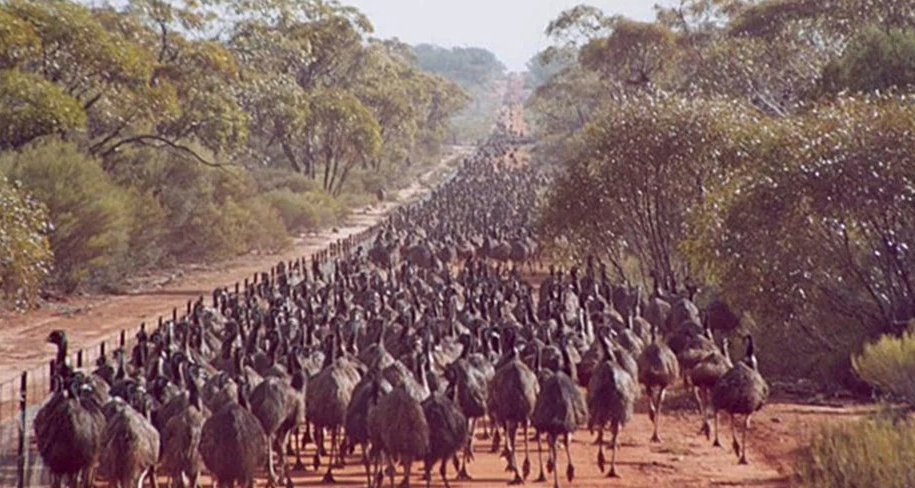</a>  
  <em>Figure 2 - The Great Emu War (Gore, 2018)</em>

 

### Gameplay and Mechanics
The gameplay & mechanics of _Emu War II_ aim to create a fast-paced, engaging gameplay environment in which the player has to both make important tactical strategy decisions as well as execute those decisions mechanically in an efficient manner. _Emu War II_'s gameplay combines elements of traditional tower-defence games with the faster-paced gameplay style of other top-down survival games to create a unique experience.
 
The core gameplay goal is to survive for five minutes as waves of emus spawn and walk down the lanes. The emus will cause the HQ to be damaged if they reach it in the centre, acting as the player's "health" in this game and will give the player an objective to defend. The game will end if the player either survives for five minutes (timer will be present on the screen at all times), causing a win, or loses all health in their HQ, which will cause a loss.

#### Perspective
The game is a 3rd person, top-down game in which the player character will be in the centre of the screen. The camera will follow the movement of the player, but will maintain a constant birds-eye view & fixed angle above to ensure the player has sufficient visibility of the nearby area. The following images demonstrate the initial concept art for this idea, as well as the implemented version within the game.

  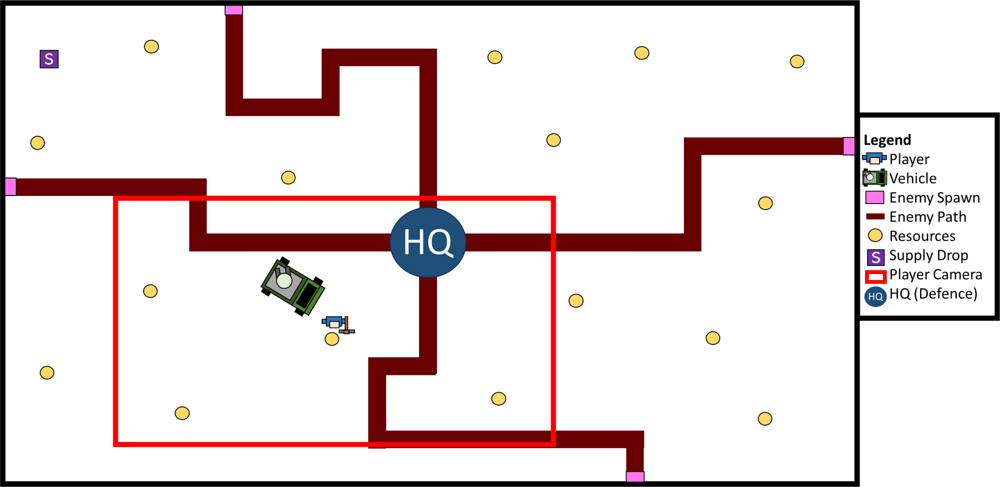  
  <em>Figure 3 - Gameplay Map Concept Art (Original)</em>
   
  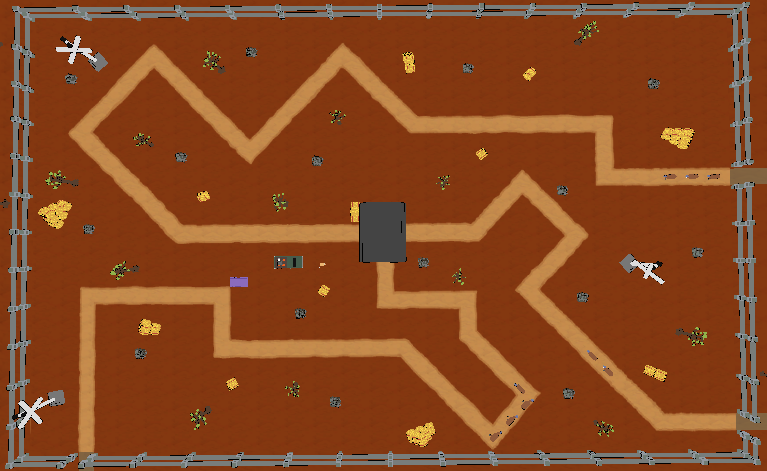  
  <em>Figure 4 - Gameplay Map Implementation (Original)</em>
   
  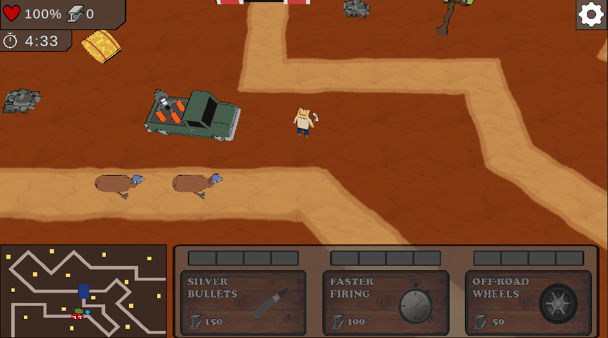  
  <em>Figure 5 - Player Perspective (Original)</em>

#### Core Gameplay Loop, Mechanics & Progression
As shown in the above figure, the player is tasked with defending the central "HQ" from the emus, which will spawn and walk down the paths from the edge of the map. The only real defence mechanism the player has is the turret on the back of the vehicle, which acts like a tower in a traditional tower defence game, will automatically shoot enemies in a range. The enemies will spawn in clusters, but these clusters will continuously spawn until 5 minutes have passed, thus creating the timed survival mechanic.
 
However, the interesting mechanic in Emu War II is that the turret will only shoot if the player is not driving the vehicle. As a result, the player will need to ensure they keep moving the vehicle around the map to deal with the enemies as they come down different lanes. A mini-map will be part of the UI in this game (discussed in User Interface section) to ensure the player is aware of new enemies spawning in and their location so they can plan ahead.
 
The following figure visually explains the balancing act between the two gameplay states the player can be in, that is, the out-of-vehicle state where the turret can shoot versus the in-vehicle state in which the player's mobility around the map is greatly increased.

  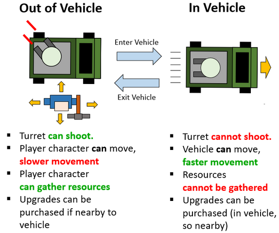  
  <em>Figure 6 - Gameplay States Comparison Summary (Original)</em>  
  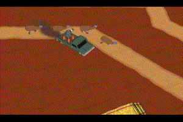  
  <em>Animated Figure 2 - Emu War II: Recording of Turret Shooting Mechanics (Original)</em>

Emerging from this balancing act between states, the player would have periods of inactivity  when the turret is cleaning up the enemies in a lane. In order to fill these gaps, there will be resource deposits all around the map which the player can interact with to gain resources. Supply drops will also spawn across the map throughout the game, which can be picked up for additional resources, encouraging the player to pick them up and move around the map.
 
These resources can then be spent on upgrades to the turret, ute and Big Davo himself, which will be required to beat the larger amounts of enemies in the later stages of the game. These upgrades will mainly be basic upgrades such as faster shooting, bigger range, damage upgrades and increased movement speed of the ute. This creates a sense of progression within the game period as well as establishing a satisfying gameplay loop as depicted in the diagram below.

  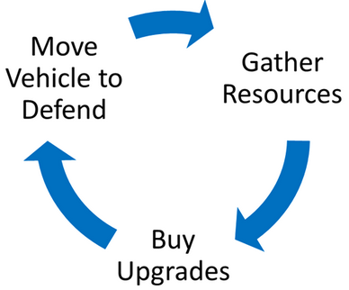  
  <em>Figure 7 - Gameplay Loop Diagram (Original)</em>

#### Upgrades
As mentioned above, there will be a range of upgrades available for the player to purchase using the game currency: 'scrap'. Scrap can be mined from various deposits on the map as well as obtained through supply drops.

The following figure depicts the current upgrade paths and their various upgrades, as well as their description:

  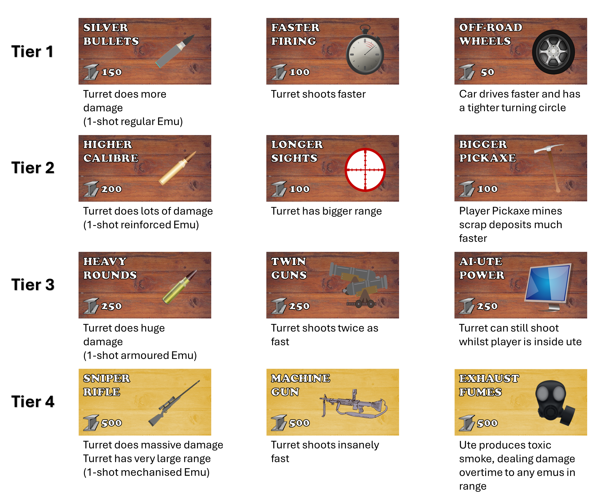  
  <em>Figure 8 - Upgrades and their Description (Original)</em>

#### Emus
The game will feature a number of different emu types for the player to face throughout the game. The more difficult emus will spawn in higher frequencies later in the game as the difficulty increases during the 5 minute survival time period.
| Emu Name          | Health    | Damage to HQ | Description | Model   |
|-------------------|-----------|--------------|-------------|---------|
| Normal Emu        | 5         | 5           | These are the most basic emus in the game. They are easily able to be destroyed by the player and will generally spawn in the early minutes of the game. | 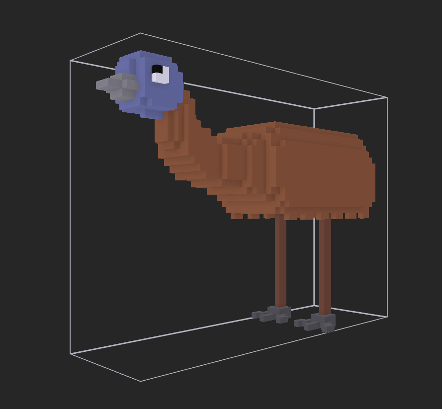 |
| Reinforced Emu    | 10        | 10           | These are reinforced emus that are able to sustain more damage. They spawn in lower amounts at the very start but progressively become one of the most common emus later in the game. | 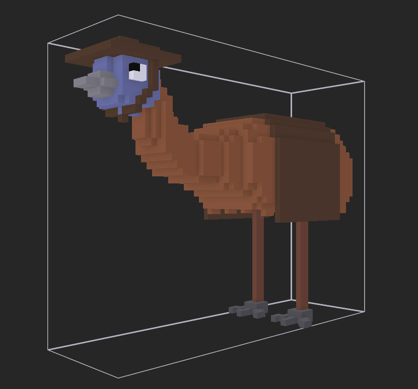 |
| Armoured Emu      | 15        | 15           | These are armoured emus that are able to sustain a large amount of damage. They only start spawning about midway through the game once the player has some upgrades. | 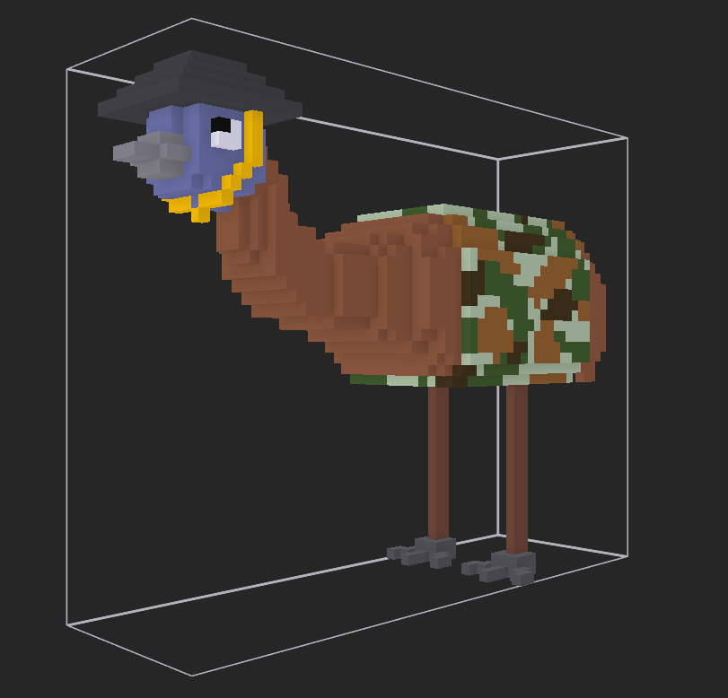 |
| Mechanised Emu    | 30        | 20           | These are mechanised emus. They are the strongest non-boss emu in the game and only spawn during the final stages of the game. The player will need to have a large number of upgrades to defeat these emus. | 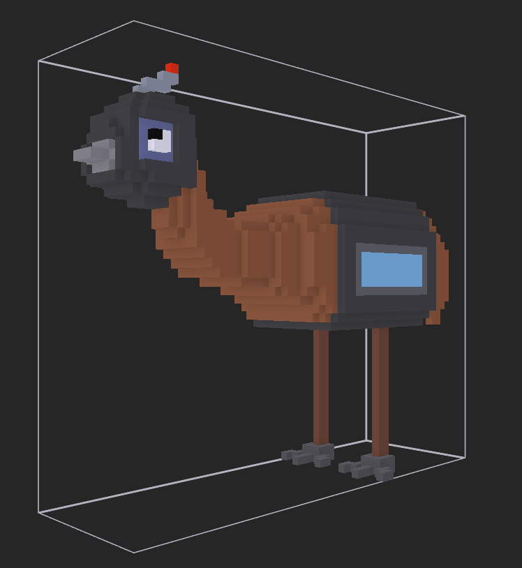 |
| Boss Emu          | 1000      | 100          | This is the boss of the emus 'The Big Bird'. The boss is larger and slower than most other emus, however the boss entering the base is an instant loss for the player. Only one instance of this emu spawns during the 5 minutes and the player will have to defeat them before they reach the base. | 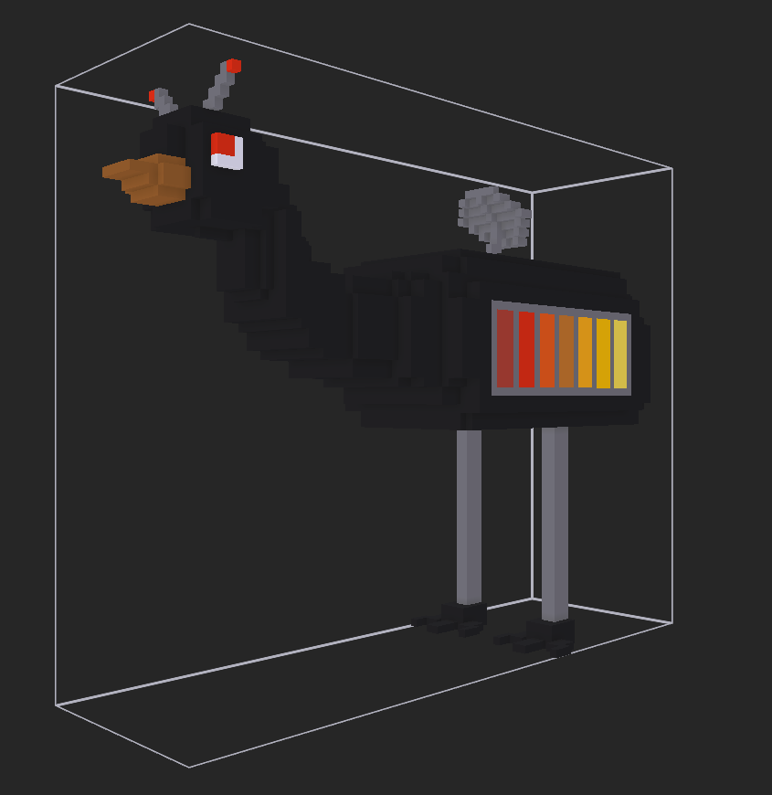 |

  <em>Table 1 - Emu War II Emu Types</em>

#### Controls
The controls of _Emu War II_ will be simple and mainly keyboard based. The control scheme is outlined the following diagram

  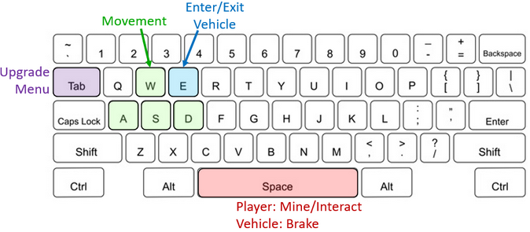  
  <em>Figure 9 - Emu War II Simple Control Scheme Overview (Original)</em>

The 'WASD' movement will feel different depending on whether or not the player is driving the vehicle. When outside the vehicle, the controls will be snappy and responsive, allowing the player to easily move around the map, in this state, they can also press 'SPACE' state to interact with resource deposits to gain resource currency (mine resources)
 
By comparison, when driving the vehicle, the movement will be more force/physics-based, with acceleration, velocity, inertia, downforce among other relatively realistic physics being present in the game. The driving physics will mean that the player will have more difficulty controlling the car, particularly if they wish to drive quickly.  The 'W' key will drive the vehicle forward, so the direction of travel in the map is dependent on the vehicle orientation. 'A' and 'D' will be used to drive left and right respectively with the 'S' key decelerating/reversing the vehicle. This is similar to most other game’s vehicle driving mechanics.
 
As the player cannot gather resources whilst driving, the 'SPACE' key will be used to apply the brakes to the vehicle, allowing the player to stop quicker. The 'E' key when used in the vehicle exits the vehicle, putting the player character outside of the vehicle. Likewise, when nearby the vehicle outside it, the player character can enter the vehicle with the 'E' key as well.

  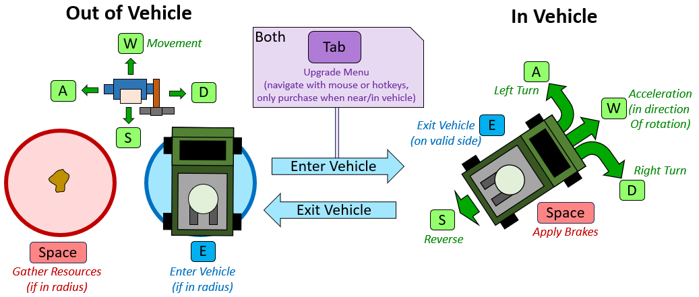  
  <em>Figure 10 - Gameplay State with Control Annotations (Original)</em>  

 
The 'TAB' key is used to open the Upgrade Menu, the Upgrade Menu can be opened at any time, but upgrades can only be purchased if nearby/in the car. The game will continue running whilst the menu is open and the player can use their mouse to navigate this menu and click on upgrades. The player can also press hotkeys instead of clicking if they would rather not use the mouse, so a keyboard only setup is possible.

The Upgrade Menu will be at the bottom of the screen so that the player can keep playing whilst having it open, but if they would rather have greater visibility, then they can close the menu. This menu being toggleable is important as player’s may be away from their vehicle and want to check how many resources they need to buy the next upgrade without actually buying it yet, which they can do at any time through this design. A visualisation of this can be seen in the User Interface section.

 

### Levels and World Design
The game world will be restricted to two axes but rendered in 3D, creating a “2.5D” environment (such as in 'Farmer's Stealing Tanks’). Currently, we have developed one map, but might add more in the future with ranging difficulties. The maps will depict a farm, with ‘lanes’ for the enemy emus to invade through to get to the barn or the ‘HQ’. For movement around the map, the player can either drive their ute around or walk. They can also bump into emus, however not causing them damage (they have grown resistant). The camera will provide a ‘three-quarters view’ to portray three-dimensional space in a two-dimensional plane. Furthermore, the camera will be able to move around (not a fixed single screen) and to accommodate for that, a minimap will be implemented for the player’s awareness. 

  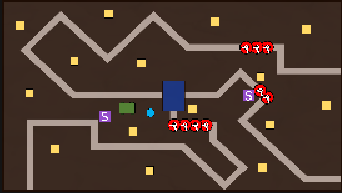  
  <em>Figure 11 - Minimap in Emu War II (Original)</em>

The following table descibred some of the objects in the game world/environment and their purpose. Each image in this table is original and was constructed in [MagicaVoxel](https://ephtracy.github.io/).
| Object             | Functionality                                                                                             | Interaction                                            | Example |
|--------------------|-----------------------------------------------------------------------------------------------------------|--------------------------------------------------------|---------|
| Barn               | The barn acts as the ‘HQ’ for the game, which serves as the player’s hp and is therefore the main objective to defend. | Will not have any interaction with other objects or assets other than taking damage from collided emus. | 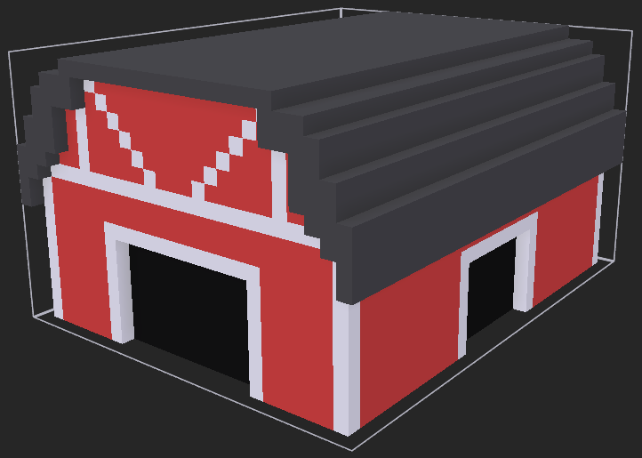 |
| Scrap Deposit      | Scrap serves as our game’s ‘resource’ that the player has to collect for upgrading the turret and ute. | Scrap interacts with the player as a resource that a player can ‘mine’ by interacting with. | 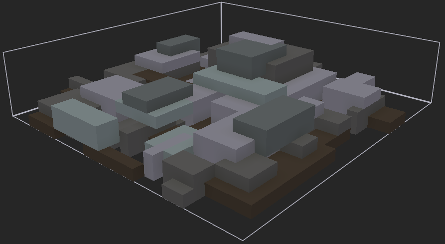 |
| Supply Drop        | Supply drops spawn across the map throughout the game, which can be picked up for additional resources. | Supply drops can be interacted by the player to obtain additional resources. | 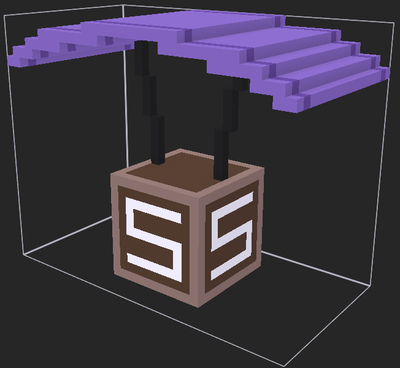 |
| Decorative Objects | Ornamental items such as hay bales and trees will be incorporated into the game, aligning with the theme and contributing to an immersive ambiance and environment. | These objects don’t interact with any other objects or assets. Moving entities are unable to pass through due to collision physics. | 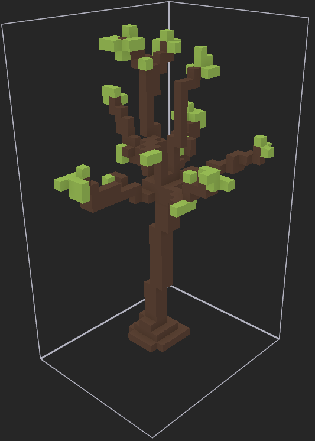 |

  <em>Table 2 - Emu War II Game World Objects</em>

 

### Art and Audio:
_Emu War II_ combines a top-down view with a 2.5D voxel graphics art style, similar to that of ['_Crossy Road_'](https://www.crossyroad.com/) and ['_Farmer's Stealing Tanks_'](https://pixelforest.itch.io/farmers-stealing-tanks). The top-down perspective provides the player with sufficient coverage of the map, whilst the 2.5D voxel graphics assists in creating the intended playful, light-hearted environment. The colour scheme will reflect that of Australian farmland, decorating the distinct orange dirt with numerous farm objects like trees, rocks and haybales.

  <a href="https://www.crossyroad.com/">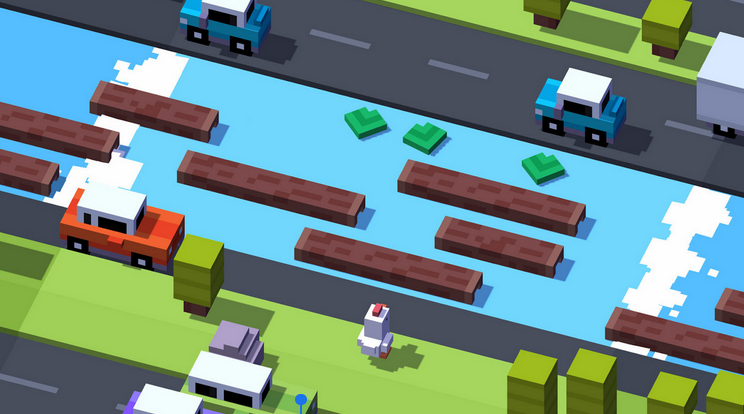</a>   
  <em>Figure 12 - Crossy Road (Hipster Whale, 2014)</em>  
   
  <a href="https://www.theland.com.au/story/6551144/property-defies-big-dry/#!">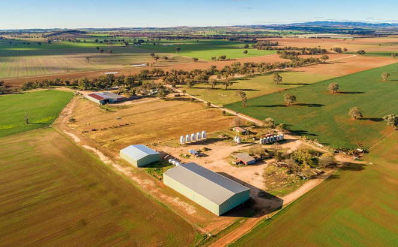</a>  
  <em>Figure 13 - Example Australian Outback Farm Landscape (Austin, 2019)</em>
  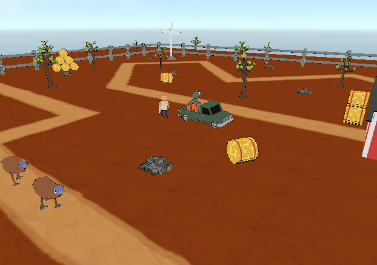  
  <em>Figure 14 - Implemented Art Style (Original)</em>

In terms of sound design, the music purposely leans towards fostering a playful, comical atmosphere, making use of upbeat orchestral pieces, rather than more gritty, intense soundtracks. Sound effects will compliment this approach, making use of retro 8-bit style sounds, in addition to some semi-realistic sound textures where appropriate (such as engine sounds and footsteps).

Most voxel assets are custom made by the team using ['_MagicaVoxel_'](https://ephtracy.github.io/), with occasional use of free-to-use assets from asset stores (e.g. Unity Asset Store, Itch.io).

  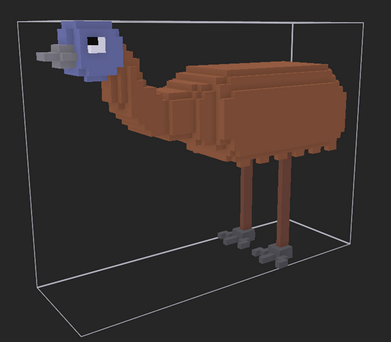
  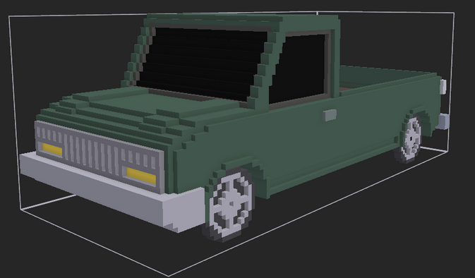  
  <em>Figure 15 - Emu & Ute Voxel Models (Original)</em>

 

### User Interface
The user interface is an important part of _Emu War II_'s gameplay and mechanics. The following diagrams provide an example of the different user interfaces the player will interact with

#### Regular in game GUI:

  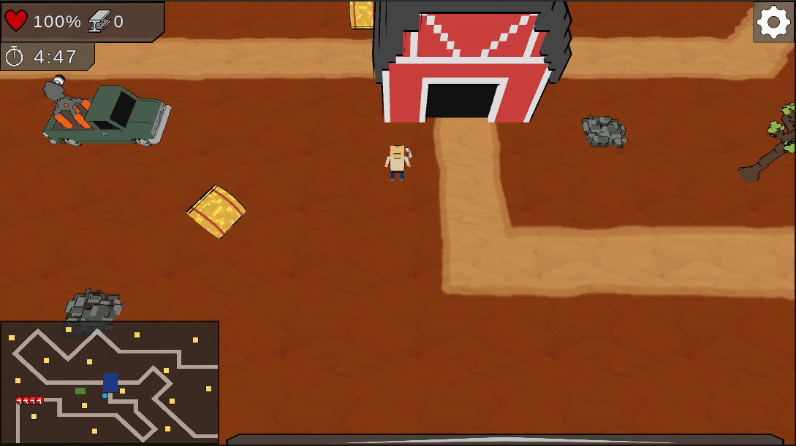  
  <em>Figure 16 - Regular in-game GUI (Original)</em>

#### Upgrades (with upgrades) Menu:

  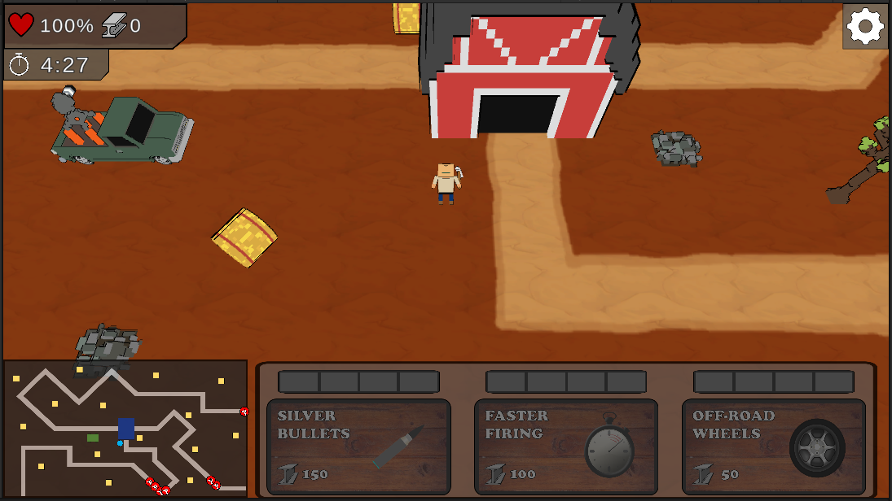  
  <em>Figure 17 - Upgrades Menu (Original)</em>

#### Settings Menu:

  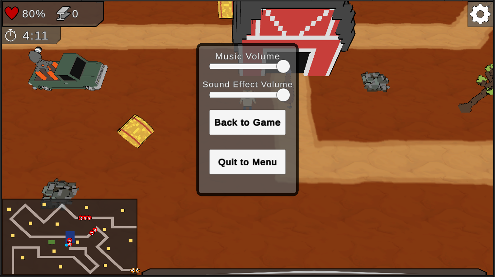  
  <em>Figure 18 - Settings Menu (Original)</em>

The settings menu will pop up when the player clicks the cog in the top right corner or when ‘ESC’ is pressed, the game will be paused while the settings menu is open

 

### External Image References
- Austin, P. (2019). _Australian farm prices remain rock solid in 2019_ [Source](https://www.theland.com.au/story/6551144/property-defies-big-dry/#!)
- Cungato, M. (2019). _TowerBag_. [Source](https://matheuscunegato.itch.io/towerbag)
- diagrams.net (2012). _Draw.io_. [Source](https://draw.io/)
- Discord (2015). _Discord_. [Source](https://discord.com/)
- Ephtracy (2015). _MagicaVoxel_. [Source](https://ephtracy.github.io/)
- Flanne. (2022). _20 Minutes Till Dawn_. [Source](https://store.steampowered.com/app/1966900/20_Minutes_Till_Dawn/)
- GitHub. (2013). _GitHub_. [Source](https://github.com/)
- Gore, J, G. (2018). _Looking back: Australia’s Emu Wars_. [Source](https://www.australiangeographic.com.au/topics/wildlife/2016/10/australias-emu-wars/)
- Hipster Whale (2014). _Crossy Road_. [Source](https://www.crossyroad.com/)
- Microsoft. (2015). _Visual Studio Code_. [Source](https://code.visualstudio.com/)
- Monday.com (2017). _Monday.com_. [Source](http://www.monday.com)
- Ninja Kiwi. (2018). _Bloons Tower Defence 6_. [Source](https://btd6.com)
- PixelForest (2022). _Farmer's Stealing Tanks_. [Source](https://pixelforest.itch.io/farmers-stealing-tanks)
- Unity. (2021). _Unity_. [Source](https://unity.com/)
- Audacity Team (2021). _Audacity: Free, Open Source, Cross-Platform Audio Software_. [Source](https://www.audacityteam.org/)
 

### Asset & Music References
- Chromisu. (2023). _Handpainted Grass & Ground Textures_ [Source](https://assetstore.unity.com/packages/2d/textures-materials/nature/handpainted-grass-ground-textures-187634#description)
- Mackro, R. (2015). _Sky Box Sunny Day_. [Source](https://opengameart.org/content/sky-box-sunny-day)
- Torres, R. (2021). _Choose Your Seeds_. [Source](https://www.youtube.com/watch?v=qN3NDdRZngs&ab_channel=ImRuscelOfficial-Topic)
- Torres, R. (2021). _Grasswalk and Moongrains_. [Source](https://www.youtube.com/watch?v=BlrdHJ5NctE&ab_channel=ImRuscelOfficial-Topic)
- Torres, R. (2021). _Graze the Roof_. [Source](https://www.youtube.com/watch?v=OC40LR8tako&ab_channel=RuscelTorres)
- Torres, R. (2021). _Rigor Mormist_. [Source](https://www.youtube.com/watch?v=BDO3HYkpS5s&ab_channel=ImRuscelOfficial-Topic)
- Torres, R. (2021). _Watery Graves_. [Source](https://www.youtube.com/watch?v=z5WakXfsXEc&ab_channel=ImRuscelOfficial-Topic)
